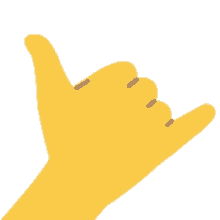

<h1>hey there </h1>

I'm Po, a full stack web developer who's always itching to learn something new.

<h2>Currently In : Miami 🌴</h2>

<h3>my coding toolbox</h3>

  
  
  
  
  
  
  
    

<h3>auxiliary toolbox</h3>

  
  

<!--
**polin0517/polin0517** is a ✨ _special_ ✨ repository because its `README.md` (this file) appears on your GitHub profile.

Here are some ideas to get you started:

- 🔭 I’m currently working on ...
- 🌱 I’m currently learning ...
- 👯 I’m looking to collaborate on ...
- 🤔 I’m looking for help with ...
- 💬 Ask me about ...
- 📫 How to reach me: ...
- 😄 Pronouns: ...
- ⚡ Fun fact: ...
-->
